# 🛌 @layout-css/tailwindcss-plugin

> Easy-to-understand layout classes for css, inspired by Figma's Auto Layout and repeatedly having to figure out common website layouts. Combined with the power of Tailwind CSS

|
[Getting Started](#getting-started) |
[Key Concepts](#key-concepts) |
[Usage](#usage) |
[Single Panel Layout](#single-panel-layout-classes) |
[Sizing Layout](#sizing-layout-classes) |
[Tailwind CSS Plugin Options](#tailwindcss-plugin-options) |
[Demo]() |
[FAQs]() |

Sleep like a baby and kiss those flexbox & CSS grid nightmares goodbye! Rest well, as you effortlessly create HTML layouts without a worry!

Yes - you can center a div with ease 😌

layout-css makes it a breeze to layout HTML with it's easy-to-understand CSS layout classes. As a Tailwind CSS plugin, you can combine layout-css's intuitive layout classes with the power of Tailwind CSS.
<br/>

<hr/>

## Getting Started

ℹ️ This guide assume you have Tailwind already setup and configured.

#### Install package

`npm i -D @layout-css/tailwindcss`

#### Add plugin to your tailwind.config.js

```js
/** @type {import('tailwindcss').Config} */
module.exports = {
  plugins: [require('@layout-css/tailwindcss')],
};
```

#### Add a layout class to the parent container.

<!-- prettier-ignore -->
```html
<div class="layout-packed-mc-x">
  <div>Hello World</div>
</div>
```

🎉 The above will center a div horizontally and vertically 🎉
<br/>
<br/>

#### Add a sizing layout class

<!-- prettier-ignore -->
```html
<!-- Sizing Class on the Parent -->
<div class="layout-packed-mc-x w-fill w-fill">
  <!-- Sizing Class on the Parent -->
  <div class="h-fixed-24 w-fixed-24">Hello World</div>
</div>
```

🎉 The above displays at full screen height and width with a 96px x 96px centered div. 🎉

**Note:** Sizing classes are designed to work anywhere regarless of whether or not a layout class is present on the parent element.
<br/>
<br/>

<hr/>

## Key Concepts

layout-css builds on the idea of utility-first classes popularised by [Tailwind CSS](https://tailwindcss.com/) and introduces the concept of layout classes. The diference is that utility-first clasess wrap a single concept in css where as the a layout class wraps multiple to achive an intent.

### Sizing Layout Classes

Sizing layout classes describe the desired behavior of the dimensions (width & hieght) of an element regardsless of the parent layout class:

- **fill**: width and/or height in parent
- **hug**: the contents of the child content along the width add/or heigh
- **fixed**: the size of the element along the width and/or height

### Single-Panel Layout Classes

Single-panel layout clasess decribe how the child elements behave in the container bases on the following properties:

#### Single Axis (x or y)

> **💡 TIP** single axis layouts map directly to the [_Auto-Layout_](https://help.figma.com/hc/en-us/articles/5731482952599-Using-auto-layout) features in the popular design tool [](https://figma.com)
> and is the inspiration for this library. For each implementation of layout-css the docs will specify how the class maps to Figma Auto-Layout controls.

- spacing: packed together or spaced apart
- **horizontal-alignment**: of child elements in the parent container<br/>
  (left, center, or right)
- **vertical-alignment**: of child elements in the parent container<br/>
  (top, middle, bottom)
- **axis**: x or y the child elments are layed out along.

#### Grid (x & y)

- **horizontal-alignment**: of child elements within the cells of the grid<br/>
  (left, center, or right)
- **vertical-alignmen**t: of child elements within the cells of the grid<br/>
  (top, middle, bottom)

### 🚧 Responsive-Multi-Panel Layout Classes

_Coming soon_
Responsisve-mulit-panel layout classes describe the behaviours commonly seen on websites across the web and how they behave across the different form factors.

- headers & navigation
- content, columns and side bars
- footers

## Usage

### Control the layout and how the child components resize

Figma is a popular tool for designing websites and apps. The Auto Layout Feature dyanmically arranges elements on the page so you don't have to manually position everything when resizing a component.

The folloing image features the Auto Layout controls in Figma. The table details what can be done out-of-the box with Tailwind CSS and where the layout-css is required.

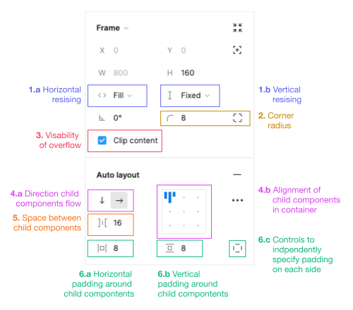

| Figma Control                                                                             | CSS Approach                                                                 |
| ----------------------------------------------------------------------------------------- | ---------------------------------------------------------------------------- |
| <span style="color:">1.a.</span> Horizontal resizing <br> 1.b. Verical resizing           | @layout-css/tailwindcss-plugin <br>[Figma Component Resizing](#sizing)       |
| 2. Corner radius                                                                          | Tailwind CSS <br>[Border Radius](https://tailwindcss.com/docs/border-radius) |
| 3. Visability if overflow                                                                 | Tailwind CSS <br>[Overflow](https://tailwindcss.com/docs/overflow)           |
| 4.a. Direction child components flow <br> 4.b. Alignment of child components in container | @layout-css/tailwindcss-plugin <br> [Figma Component Alignment](#sizing)     |
| 5. Space between child components                                                         | Tailwind CSS <br> [Gap](https://tailwindcss.com/docs/gap)                    |
| 6.a. Horizontal padding, 6.b. Vertical padding                                            | Tailwind CSS <br> [Padding](https://tailwindcss.com/docs/padding)            |

### Example

The image below is controled by the html below.


###### HTML

<!-- prettier-ignore -->
```html
<div class="layout-packed-tl-x gap-4 p-4 overflow-hidden w-fill h-fixed-40">
  <p class="w-hug h-hug">paragraph</p>
  <div class="w-hug h-fill">div</div>
  <span class="w-fill h-fixed-48">span</span>
</div>
```

<br/>

## Single Panel Layout Classes

### Layout Class Structure

A layout class is made up of up to two parts `LayoutType-AlignmentType` e.g. `layout-packed-tl-x`

<br/>

### Layout Properties

`layout-packed`: packs the child elemnts together in the container.

`layout-spaced`: spaces the child elemnts across the full width of the container.

`layout-grid`: spaces the child elements within the cell of a grid.

<br/>

### Alignment Properties

`layout-packed-[horizontal][vertical]-[axis]` has three properties: horizontal alignment, vertical alignment and axis

- Vertical Alignment: Top `t` | Middle `m` | Bottom `b`
- Horizontal Alignment: Left `l` | Center `c` | Right `r`
- Axis: X `x` | Y `y`

`layout-spaced-[alignment]` has one property alignment

- Alignment: Top `t` | Middle `m` | Bottom `b` | Left `l` | Center `c` | Right `r`

`layout-grid-[horizontal][vertical]` has two properties: horizontal alignment and vertical alignment.

- Vertical Alignment: Top `t` | Middle `m` | Bottom `b`
- Horizontal Alignment: Left `l` | Center `c` | Right `r`

<br/>
<br/>

### Single Axis Layouts Classes

#### 📐 Layout: Packed Top-Left across the X-axis

Use `layout-packed-tl-x` to align child elements at the top left of the container with them packed together.

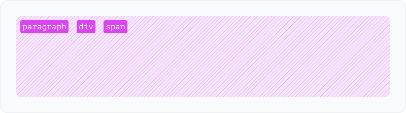

##### HTML

<!-- prettier-ignore -->
```html
<div class="layout-packed-tl-x gap-4 p-2 overflow-hidden w-fill h-fixed-40 rounded-lg">
  <p class="w-hug h-hug">paragraph</p>
  <div class="w-hug h-fill">div</div>
  <span class="w-hug h-fixed-48">span</span>
</div>
```

##### Figma Auto Layout Settings

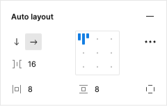

<br>
<br>

#### 📐 Layout: Packed Top-Center across the X-axis

Use `layout-packed-tc-x` to align child elements at the top center of the container with them packed together.

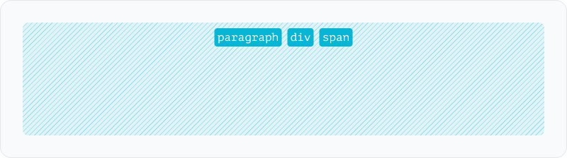

##### HTML

<!-- prettier-ignore -->
```html
<div class="layout-packed-tc-x gap-4 p-2 overflow-hidden w-fill h-fixed-40 rounded-lg">
  <p class="w-hug h-hug">paragraph</p>
  <div class="w-hug h-hug">div</div>
  <span class="w-hug h-hug">span</span>
</div>
```

##### Figma Auto Layout Settings

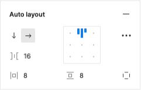

<br>
<br>

#### 📐 Layout: Packed Top-Right across the X-axis

Use `layout-packed-tr-x` to align child elements at the top right of the container with them packed together.

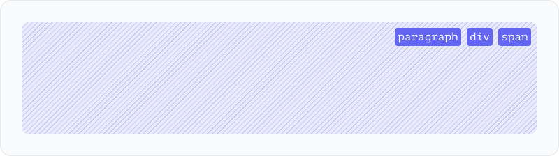

##### HTML

<!-- prettier-ignore -->
```html
<div class="layout-packed-tr-x gap-4 p-2 overflow-hidden w-fill h-fixed-40 rounded-lg">
  <p class="w-hug h-hug">paragraph</p>
  <div class="w-hug h-hug">div</div>
  <span class="w-hug h-hug">span</span>
</div>
```

##### Figma Auto Layout Settings

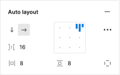

<br>
<br>

#### 📐 Layout: Packed Middle-Left across the X-axis

Use `layout-packed-ml-x` to align child elements at the middle left of the container with them packed together.

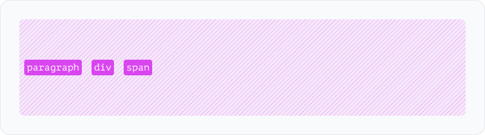

##### HTML

<!-- prettier-ignore -->
```html
<div class="layout-packed-ml-x gap-4 p-2 overflow-hidden w-fill h-fixed-40 rounded-lg">
  <p class="w-hug h-hug">paragraph</p>
  <div class="w-hug h-hug">div</div>
  <span class="w-hug h-hug">span</span>
</div>
```

##### Figma Auto Layout Settings

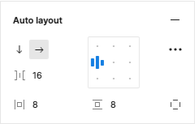

<br>
<br>

#### 📐 Layout: Packed Middle-Center across the X-axis

Use `layout-packed-mc-x` to align child elements at the middle center of the container with them packed together.

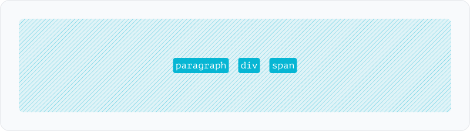

##### HTML

<!-- prettier-ignore -->
```html
<div class="layout-packed-mc-x gap-4 p-2 overflow-hidden w-fill h-fixed-40 rounded-lg">
  <p class="w-hug h-hug">paragraph</p>
  <div class="w-hug h-hug">div</div>
  <span class="w-hug h-hug">span</span>
</div>
```

##### Figma Auto Layout Settings

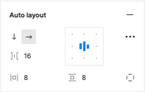

<br>
<br>

#### 📐 Layout: Packed Middle-Right across the X-axis

Use `layout-packed-mr-x` to align child elements at the middle right of the container with them packed together.

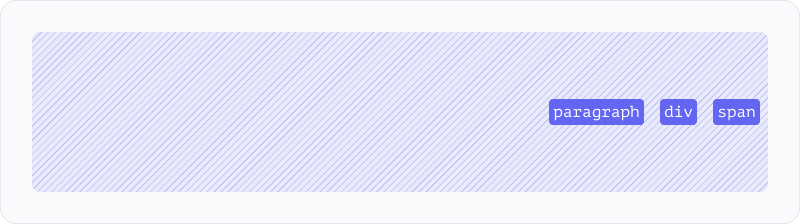

##### HTML

<!-- prettier-ignore -->
```html
<div class="layout-packed-mr-x gap-4 p-2 overflow-hidden w-fill h-fixed-40 rounded-lg">
  <p class="w-hug h-hug">paragraph</p>
  <div class="w-hug h-hug">div</div>
  <span class="w-hug h-hug">span</span>
</div>
```

##### Figma Auto Layout Settings

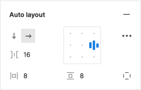

<br>
<br>

#### 📐 Layout: Packed Bottom-Left across the X-axis

Use `layout-packed-bl-x` to align child elements at the bottom left of the container with them packed together.

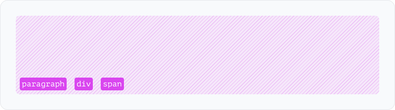

##### HTML

<!-- prettier-ignore -->
```html
<div class="layout-packed-bl-x gap-4 p-2 overflow-hidden w-fill h-fixed-40 rounded-lg">
  <p class="w-hug h-hug">paragraph</p>
  <div class="w-hug h-hug">div</div>
  <span class="w-hug h-hug">span</span>
</div>
```

##### Figma Auto Layout Settings

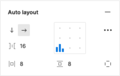

<br>
<br>

#### 📐 Layout: Packed Bottom-Center across the X-axis

Use `layout-packed-bc-x` to align child elements at the bottom center of the container with them packed together.

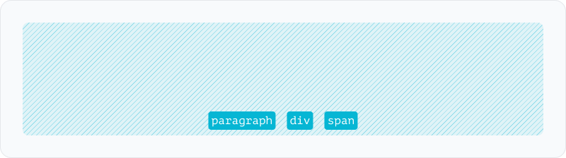

##### HTML

<!-- prettier-ignore -->
```html
<div class="layout-packed-bc-x gap-4 p-2 overflow-hidden w-fill h-fixed-40 rounded-lg">
  <p class="w-hug h-hug">paragraph</p>
  <div class="w-hug h-hug">div</div>
  <span class="w-hug h-hug">span</span>
</div>
```

##### Figma Auto Layout Settings

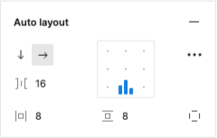

<br>
<br>

#### 📐 Layout: Packed Bottom-Right across the X-axis

Use `layout-packed-br-x` to align child elements at the bottom right of the container with them packed together.


##### HTML

<!-- prettier-ignore -->
```html
<div class="layout-packed-br-x gap-4 p-2 overflow-hidden w-fill h-fixed-40 rounded-lg">
  <p class="w-hug h-hug">paragraph</p>
  <div class="w-hug h-hug">div</div>
  <span class="w-hug h-hug">span</span>
</div>
```

##### Figma Auto Layout Settings

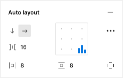

<br>
<br>

#### 📐 Layout: Packed Top-Left across the Y-axis

Use `layout-packed-tl-y` to align child elements at the top left of the container with them packed together.

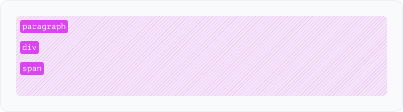

##### HTML

<!-- prettier-ignore -->
```html
<div class="layout-packed-tl-y gap-4 p-2 overflow-hidden w-fill h-fixed-40 rounded-lg">
  <p class="w-hug h-hug">paragraph</p>
  <div class="w-hug h-hug">div</div>
  <span class="w-hug h-hug">span</span>
</div>
```

##### Figma Auto Layout Settings

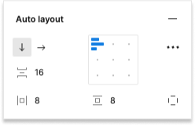

<br>
<br>

#### 📐 Layout: Packed Top-Center across the Y-axis

Use `layout-packed-tc-y` to align child elements at the top center of the container with them packed together.

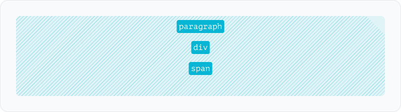

##### HTML

<!-- prettier-ignore -->
```html
<div class="layout-packed-tc-y gap-4 p-2 overflow-hidden w-fill h-fixed-40 rounded-lg">
  <p class="w-hug h-hug">paragraph</p>
  <div class="w-hug h-hug">div</div>
  <span class="w-hug h-hug">span</span>
</div>
```

##### Figma Auto Layout Settings

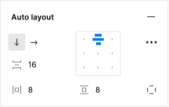

<br>
<br>

#### 📐 Layout: Packed Top-Right across the Y-axis

Use `layout-packed-tr-y` to align child elements at the top right of the container with them packed together.

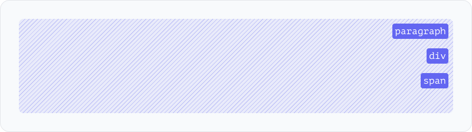

##### HTML

<!-- prettier-ignore -->
```html
<div class="layout-packed-tr-y gap-4 p-2 overflow-hidden w-fill h-fixed-40 rounded-lg">
  <p class="w-hug h-hug">paragraph</p>
  <div class="w-hug h-hug">div</div>
  <span class="w-hug h-hug">span</span>
</div>
```

##### Figma Auto Layout Settings

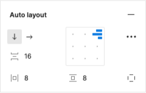

<br>
<br>

#### 📐 Layout: Packed Middle-Left across the Y-axis

Use `layout-packed-ml-y` to align child elements at the middle left of the container with them packed together.

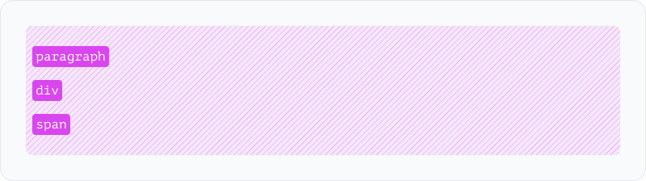

##### HTML

<!-- prettier-ignore -->
```html
<div class="layout-packed-ml-y gap-4 p-2 overflow-hidden w-fill h-fixed-40 rounded-lg">
  <p class="w-hug h-hug">paragraph</p>
  <div class="w-hug h-hug">div</div>
  <span class="w-hug h-hug">span</span>
</div>
```

##### Figma Auto Layout Settings

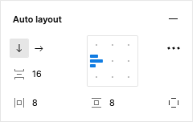

<br>
<br>

#### 📐 Layout: Packed Middle-Center across the Y-axis

Use `layout-packed-mc-y` to align child elements at the middle center of the container with them packed together.

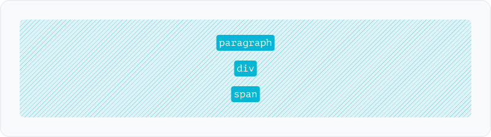

##### HTML

<!-- prettier-ignore -->
```html
<div class="layout-packed-mc-y gap-4 p-2 overflow-hidden w-fill h-fixed-40 rounded-lg">
  <p class="w-hug h-hug">paragraph</p>
  <div class="w-hug h-hug">div</div>
  <span class="w-hug h-hug">span</span>
</div>
```

##### Figma Auto Layout Settings

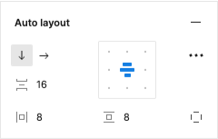

<br>
<br>

#### 📐 Layout: Packed Middle-Right across the Y-axis

Use `layout-packed-mr-y` to align child elements at the middle right of the container with them packed together.

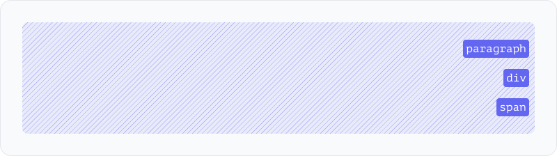

##### HTML

<!-- prettier-ignore -->
```html
<div class="layout-packed-mr-y gap-4 p-2 overflow-hidden w-fill h-fixed-40 rounded-lg">
  <p class="w-hug h-hug">paragraph</p>
  <div class="w-hug h-hug">div</div>
  <span class="w-hug h-hug">span</span>
</div>
```

##### Figma Auto Layout Settings

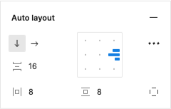

<br>
<br>

#### 📐 Layout: Packed Bottom-Left across the Y-axis

Use `layout-packed-bl-y` to align child elements at the bottom left of the container with them packed together.

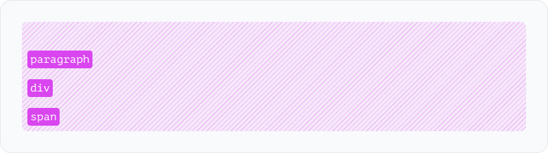

##### HTML

<!-- prettier-ignore -->
```html
<div class="layout-packed-bl-y gap-4 p-2 overflow-hidden w-fill h-fixed-40 rounded-lg">
  <p class="w-hug h-hug">paragraph</p>
  <div class="w-hug h-hug">div</div>
  <span class="w-hug h-hug">span</span>
</div>
```

##### Figma Auto Layout Settings

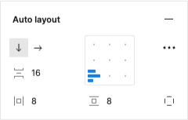

<br>
<br>

#### 📐 Layout: Packed Bottom-Center across the Y-axis

Use `layout-packed-bc-y` to align child elements at the bottom center of the container with them packed together.

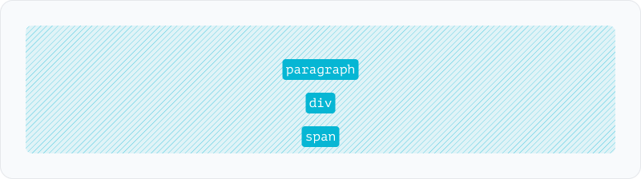

##### HTML

<!-- prettier-ignore -->
```html
<div class="layout-packed-bc-y gap-4 p-2 overflow-hidden w-fill h-fixed-40 rounded-lg">
  <p class="w-hug h-hug">paragraph</p>
  <div class="w-hug h-hug">div</div>
  <span class="w-hug h-hug">span</span>
</div>
```

##### Figma Auto Layout Settings

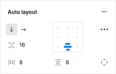

<br>
<br>

#### 📐 Layout: Packed Bottom-Right across the Y-axis

Use `layout-packed-br-y` to align child elements at the bottom right of the container with them packed together.

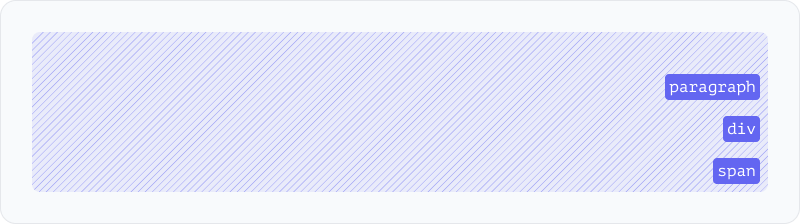

##### HTML

<!-- prettier-ignore -->
```html
<div class="layout-packed-br-y gap-4 p-2 overflow-hidden w-fill h-fixed-40 rounded-lg">
  <p class="w-hug h-hug">paragraph</p>
  <div class="w-hug h-hug">div</div>
  <span class="w-hug h-hug">span</span>
</div>
```

##### Figma Auto Layout Settings

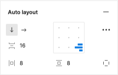

<br>
<br>

#### 📐 Layout: Spaced down the Left

Use `layout-spaced-l` to space child elements down along the left of the container.

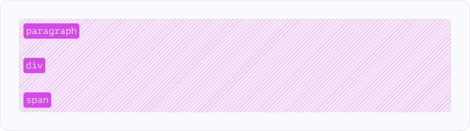

##### HTML

<!-- prettier-ignore -->
```html
<div class="layout-spaced-l p-2 overflow-hidden w-fill h-fixed-40 rounded-lg">
  <p class="w-hug h-hug">paragraph</p>
  <div class="w-hug h-hug">div</div>
  <span class="w-hug h-hug">span</span>
</div>
```

##### Figma Auto Layout Settings

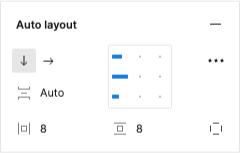

<br>
<br>

#### 📐 Layout: Spaced down the Center

Use `layout-spaced-c` to space child elements down along the center of the container.

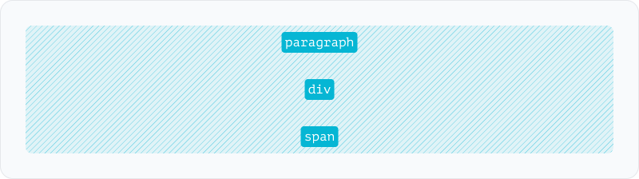

##### HTML

<!-- prettier-ignore -->
```html
<div class="layout-spaced-c p-2 overflow-hidden w-fill h-fixed-40 rounded-lg">
  <p class="w-hug h-hug">paragraph</p>
  <div class="w-hug h-hug">div</div>
  <span class="w-hug h-hug">span</span>
</div>
```

##### Figma Auto Layout Settings

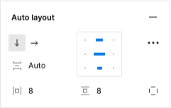

<br>
<br>

#### 📐 Layout: Spaced down the Right

Use `layout-spaced-r` to space child elements down along the right of the container.

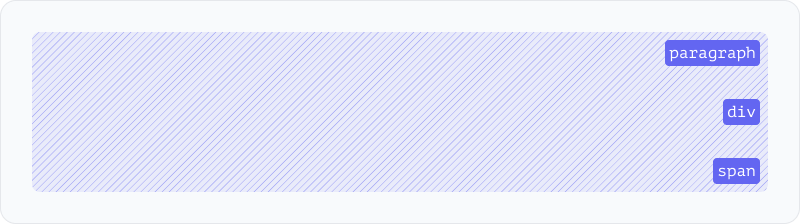

##### HTML

<!-- prettier-ignore -->
```html
<div class="layout-spaced-r p-2 overflow-hidden w-fill h-fixed-40 rounded-lg">
  <p class="w-hug h-hug">paragraph</p>
  <div class="w-hug h-hug">div</div>
  <span class="w-hug h-hug">span</span>
</div>
```

##### Figma Auto Layout Settings

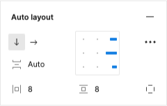

<br>
<br>

#### 📐 Layout: Spaced across the Top

Use `layout-spaced-t` to space child elements across the top of the container.

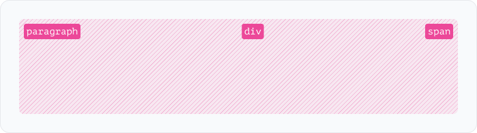

##### HTML

<!-- prettier-ignore -->
```html
<div class="layout-spaced-t p-2 overflow-hidden w-fill h-fixed-40 rounded-lg">
  <p class="w-hug h-hug">paragraph</p>
  <div class="w-hug h-hug">div</div>
  <span class="w-hug h-hug">span</span>
</div>
```

##### Figma Auto Layout Settings

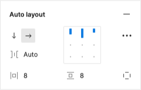

<br>
<br>

#### 📐 Layout: Spaced across the Middle

Use `layout-spaced-m` to space child elements across the middle of the container.

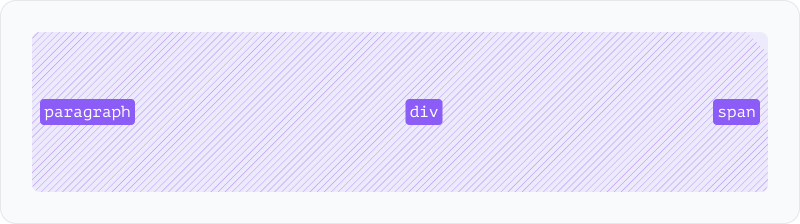

##### HTML

<!-- prettier-ignore -->
```html
<div class="layout-spaced-m p-2 overflow-hidden w-fill h-fixed-40 rounded-lg">
  <p class="w-hug h-hug">paragraph</p>
  <div class="w-hug h-hug">div</div>
  <span class="w-hug h-hug">span</span>
</div>
```

##### Figma Auto Layout Settings

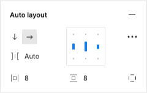

<br>
<br>

#### 📐 Layout: Spaced across the Bottom

Use `layout-spaced-b` to space child elements across the bottom of the container.


##### HTML

<!-- prettier-ignore -->
```html
<div class="layout-spaced-b p-2 overflow-hidden w-fill h-fixed-40 rounded-lg">
  <p class="w-hug h-hug">paragraph</p>
  <div class="w-hug h-hug">div</div>
  <span class="w-hug h-hug">span</span>
</div>
```

##### Figma Auto Layout Settings

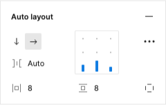

### ⭐️ Bonus ⭐️ : Auto Layout Grids

Figma doesn't have a capability for Grids in Auto Layout - this is my attempt at how it could work. These component classes are aimed at simplifying the use of CSS Grid Layout with Tailwind CSS.
<br/>
<br/>

<br>
<br>

### Grid Layout Classes

#### 📐 Layout: Grid with items in the cell's Top Left

Use `layout-grid-tl` to align child elements at the top left of each cell in the grid.

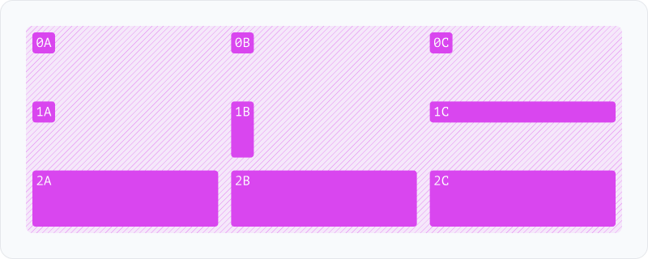

##### HTML

<!-- prettier-ignore -->
```html
<div class="layout-grid-tl grid-cols-3 gap-4 p-2 overflow-hidden w-fill h-fixed-40 rounded-lg">
  <div class="w-hug h-hug">0A</div>
  <div class="w-hug h-hug">0B</div>
  <div class="w-hug h-hug">0C</div>
  <div class="w-hug h-hug">1A</div>
  <div class="w-hug h-fill">1B</div>
  <div class="w-fill h-hug">1C</div>
  <div class="w-fill h-fill">2A</div>
  <div class="w-fill h-fill">2B</div>
  <div class="w-fill h-fill">2C</div>
</div>
```

<br>
<br>

#### 📐 Layout: Grid with items in the cell's Top Center

Use `layout-grid-tc` to align child elements at the top center of each cell in the grid.

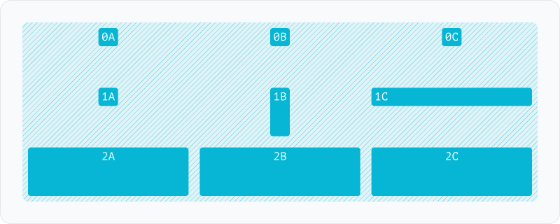

##### HTML

<!-- prettier-ignore -->
```html
<div class="layout-grid-tc grid-cols-3 gap-4 p-2 overflow-hidden w-fill h-fixed-40 rounded-lg">
  <div class="w-hug h-hug">0A</div>
  <div class="w-hug h-hug">0B</div>
  <div class="w-hug h-hug">0C</div>
  <div class="w-hug h-hug">1A</div>
  <div class="w-hug h-fill">1B</div>
  <div class="w-fill h-hug">1C</div>
  <div class="w-fill h-fill">2A</div>
  <div class="w-fill h-fill">2B</div>
  <div class="w-fill h-fill">2C</div>
</div>
```

<br>
<br>

#### 📐 Layout: Grid with items in the cell's Top Right

Use `layout-grid-tr` to align child elements at the top right of each cell in the grid.

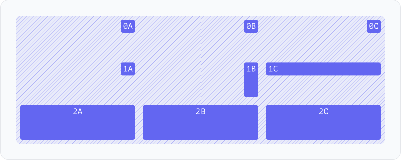

##### HTML

<!-- prettier-ignore -->
```html
<div class="layout-grid-tr grid-cols-3 gap-4 p-2 overflow-hidden w-fill h-fixed-40 rounded-lg">
  <div class="w-hug h-hug">0A</div>
  <div class="w-hug h-hug">0B</div>
  <div class="w-hug h-hug">0C</div>
  <div class="w-hug h-hug">1A</div>
  <div class="w-hug h-fill">1B</div>
  <div class="w-fill h-hug">1C</div>
  <div class="w-fill h-fill">2A</div>
  <div class="w-fill h-fill">2B</div>
  <div class="w-fill h-fill">2C</div>
</div>
```

<br>
<br>

#### 📐 Layout: Grid with items in the cell's Middle Left

Use `layout-grid-ml` to align child elements at the middle left of each cell in the grid.


##### HTML

<!-- prettier-ignore -->
```html
<div class="layout-grid-ml grid-cols-3 gap-4 p-2 overflow-hidden w-fill h-fixed-40 rounded-lg">
  <div class="w-hug h-hug">0A</div>
  <div class="w-hug h-hug">0B</div>
  <div class="w-hug h-hug">0C</div>
  <div class="w-hug h-hug">1A</div>
  <div class="w-hug h-fill">1B</div>
  <div class="w-fill h-hug">1C</div>
  <div class="w-fill h-fill">2A</div>
  <div class="w-fill h-fill">2B</div>
  <div class="w-fill h-fill">2C</div>
</div>
```

<br>
<br>

#### 📐 Layout: Grid with items in the cell's Middle Center

Use `layout-grid-mc` to align child elements at the middle center of each cell in the grid.


##### HTML

<!-- prettier-ignore -->
```html
<div class="layout-grid-mc grid-cols-3 gap-4 p-2 overflow-hidden w-fill h-fixed-40 rounded-lg">
  <div class="w-hug h-hug">0A</div>
  <div class="w-hug h-hug">0B</div>
  <div class="w-hug h-hug">0C</div>
  <div class="w-hug h-hug">1A</div>
  <div class="w-hug h-fill">1B</div>
  <div class="w-fill h-hug">1C</div>
  <div class="w-fill h-fill">2A</div>
  <div class="w-fill h-fill">2B</div>
  <div class="w-fill h-fill">2C</div>
</div>
```

<br>
<br>

#### 📐 Layout: Grid with items in the cell's Middle Right

Use `layout-grid-mr` to align child elements at the middle right of each cell in the grid.


##### HTML

<!-- prettier-ignore -->
```html
<div class="layout-grid-mr grid-cols-3 gap-4 p-2 overflow-hidden w-fill h-fixed-40 rounded-lg">
  <div class="w-hug h-hug">0A</div>
  <div class="w-hug h-hug">0B</div>
  <div class="w-hug h-hug">0C</div>
  <div class="w-hug h-hug">1A</div>
  <div class="w-hug h-fill">1B</div>
  <div class="w-fill h-hug">1C</div>
  <div class="w-fill h-fill">2A</div>
  <div class="w-fill h-fill">2B</div>
  <div class="w-fill h-fill">2C</div>
</div>
```

<br>
<br>

#### 📐 Layout: Grid with items in the cell's Bottom Left

Use `layout-grid-bc` to align child elements at the bottom left of each cell in the grid.


##### HTML

<!-- prettier-ignore -->
```html
<div class="layout-grid-bl grid-cols-3 gap-4 p-2 overflow-hidden w-fill h-fixed-40 rounded-lg">
  <div class="w-hug h-hug">0A</div>
  <div class="w-hug h-hug">0B</div>
  <div class="w-hug h-hug">0C</div>
  <div class="w-hug h-hug">1A</div>
  <div class="w-hug h-fill">1B</div>
  <div class="w-fill h-hug">1C</div>
  <div class="w-fill h-fill">2A</div>
  <div class="w-fill h-fill">2B</div>
  <div class="w-fill h-fill">2C</div>
</div>
```

<br>
<br>

#### 📐 Layout: Grid with items in the cell's Bottom Center

Use `layout-grid-bc` to align child elements at the bottom center of each cell in the grid.


##### HTML

<!-- prettier-ignore -->
```html
<div class="layout-grid-bc grid-cols-3 gap-4 p-2 overflow-hidden w-fill h-fixed-40 rounded-lg">
  <div class="w-hug h-hug">0A</div>
  <div class="w-hug h-hug">0B</div>
  <div class="w-hug h-hug">0C</div>
  <div class="w-hug h-hug">1A</div>
  <div class="w-hug h-fill">1B</div>
  <div class="w-fill h-hug">1C</div>
  <div class="w-fill h-fill">2A</div>
  <div class="w-fill h-fill">2B</div>
  <div class="w-fill h-fill">2C</div>
</div>
```

<br>
<br>

#### 📐 Layout: Grid with items in the cell's Bottom Right

Use `layout-grid-br` to align child elements at the bottom right of each cell in the grid.


##### HTML

<!-- prettier-ignore -->
```html
<div class="layout-grid-br grid-cols-3 gap-4 p-2 overflow-hidden w-fill h-fixed-40 rounded-lg">
  <div class="w-hug h-hug">0A</div>
  <div class="w-hug h-hug">0B</div>
  <div class="w-hug h-hug">0C</div>
  <div class="w-hug h-hug">1A</div>
  <div class="w-hug h-fill">1B</div>
  <div class="w-fill h-hug">1C</div>
  <div class="w-fill h-fill">2A</div>
  <div class="w-fill h-fill">2B</div>
  <div class="w-fill h-fill">2C</div>
</div>
```

<br/>

### Layout Helpers

#### 📐 Layout: Inital HTML

Use `layout-initial-html` sets the html defaults using the CSS `inital` property.

<br/>

#### 📐 Layout: Revert HTML

Use `layout-revert-html` sets the html defaults using the CSS `revert` property.

<br/>
<hr/>

## Sizing Layout Classes

<br/>

Controlling size and resizing behavior in CSS through the specification of properties on both parent and child elements can be challenging. 🛌 layout-css simplifies this process by giving control to the child component for resizing within the parent. This library shares the same opinion as Figma, advocating for child components to dictate their own resizing behavior.

> 🚨 Attention: The use of Tailwind CSS size utility classes such as h-full or w-full, h-{number}, and w-{number} may not produce expected results when combined with layout-css classes. This is due to hiding complexity of setting width in flex-box, flex-direction, and grid.

<br/>

### ↔️ Width

`w-hug` the element hugs the width of it's content.

`w-fill` the element fills the remaining width of it's parent element.

`w-fixed-{number}` fixed width based on sizes set in Tailwind CSS Config.

`w-fixed-[css-size]` fixed width based on Tailwind CSS JIT.


##### HTML

<!-- prettier-ignore -->
```html
<div class="layout-packed-tl-x gap-4 p-2 overflow-hidden w-fill h-fixed-40 rounded-lg">
  <div class="w-hug h-hug">w-hug</div>
  <div class="w-fill h-hug">w-fill</div>
  <div class="w-fixed-44 h-hug">w-fixed-44</div>
  <div class="w-fixed-[160px] h-hug">w-fixed-[160px]</div>
</div>
```

<br/>

### ↕ Height

`h-hug` the element hugs the height of it's content.

`h-fill` the element fills the remaining height of it's parent element.

`h-fixed-{number}` fixed height based on sizes set in Tailwind CSS Config.

`h-fixed-[css-size]` fixed height based on Tailwind CSS JIT.


##### HTML

<!-- prettier-ignore -->
```html
<div class=" gap-4 p-2 overflow-hidden w-fill h-hug rounded-lg">
  <div class="w-fill h-hug">h-hug</div>
  <div class="w-fill h-fill">h-fill</div>
  <div class="w-fill h-fixed-20">h-fixed-44</div>
  <div class="w-fill h-fixed-[64px]">h-fixed-[160px]</div>
</div>
```

<br/>

### 🔲 Size

Shorthand helper class for setting the same width and height property.

`s-hug` the element hugs the width and height of it's content.

`s-fill` the element fills the remaining width and height of it's parent element.

<br/>

## Tailwind CSS Plugin Options

Note: To ensure height and width work consistantly layout-css sets the following overrides which can be turned off if need be :

<br/>

### Html and Body elements maximum a height and width

In most cases it's desirable to have the top most elements fill the entire viewport.

It can be disable by configuring one or both of the following:

```javascript
// ./tailwind.config.js
module.exports = {
  plugins: [
    require(@layout-css/tailwindcss)({
      pageHeightDefaultFill: false,  // Default TRUE
      pageWidthDefaultFill: false,   // Default TRUE
    }),
  ],
};
```

<br>

### Default behavior

- Elements without a layout class will respect default html block & inline element behavior.
- `body` & `html` both have `width` and `height` set to `100%`

<br/>

## Demo

If you are interested in comparing layouts with and without check out the following Tailwind CSS play links:

- ❌ [Without layout-css](https://) **🚧 Coming Soon**

- ✅ [With layout-css](https://) **🚧 Coming Soon**

<br>

## FAQs

This is a list of questions so far. Join the [Tailwind Discord]("https://tailwindcss.com/discord") for more and to share your ideas and feedback in the plugins channel.

<br>

##### Q: Do I need Tailwind CSS to use this layout-css?

A: Hopefully not for long
_**🚧 Coming soon**_

- [@layout-css/plain-css](https://github.com/layout-css/plain-css)
- [@layout-css/vanilla-extract](https://github.com/layout-css/vanilla-extract) (CSS in JS/TS)

<br>

##### Q: Why not just learn how CSS Felxbox and Grid work?

A: How many times have you read the reference and still not remember how it works... this indicates these concepts as they are in the CSS specification aren't intuitive enough. Figma's model for thinking about layout is more intuitive.
